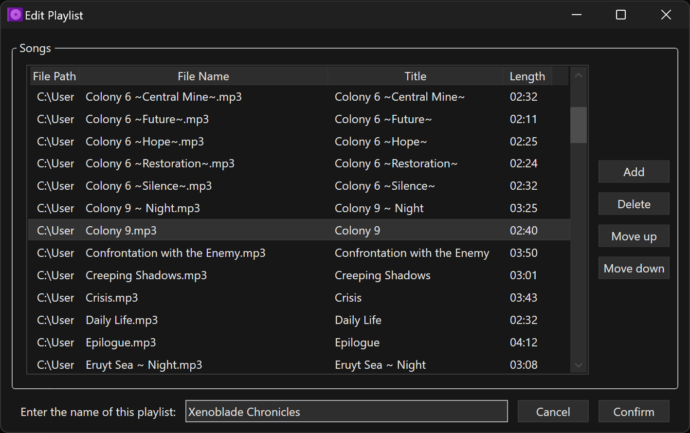

# AudioPlayerWPF
An audio player built with .NET's WPF framework that provides several useful features, such as editing tag properties (including album art), creating playlists, creating bookmarks, managing custom starting and ending song positions, and volume control on a per-song basis.

## Screenshots

## Required Dependencies (NuGet):
- TagLib#

## Notes
- If you are experiencing strange audio volume fluctuations, disable Dolby Atmos effects for speakers and headphones until I can figure out how to fix the issue.
