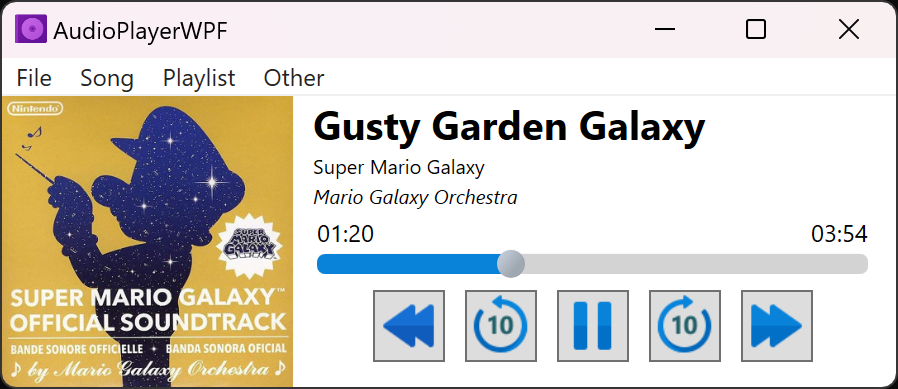
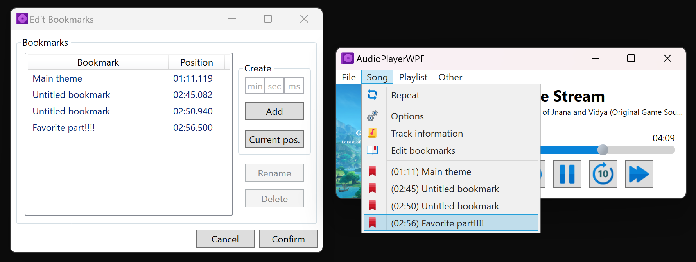

# AudioPlayerWPF
An audio player built with .NET's WPF framework that provides several useful features, such as editing tag properties, playlists, bookmarks, and other individual song settings.

Screenshots

Required Dependencies (NuGet):
- TagLib#

Some things to note:
- I created a custom linked list class because initially I thought it would be faster for its constant add/remove time. In hindsight, a regular array would probably be faster for reasonable sized playlists.
